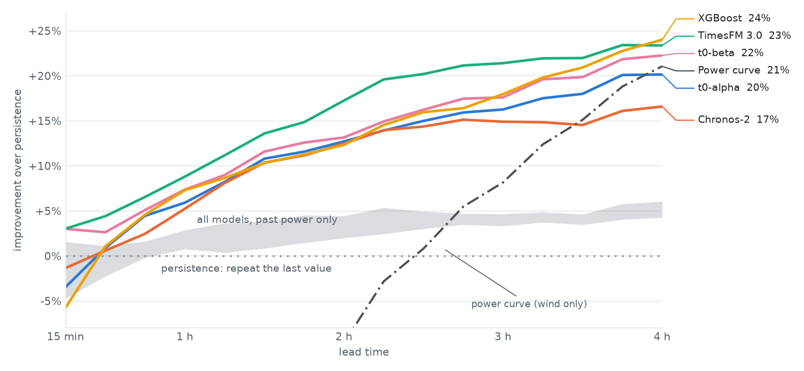
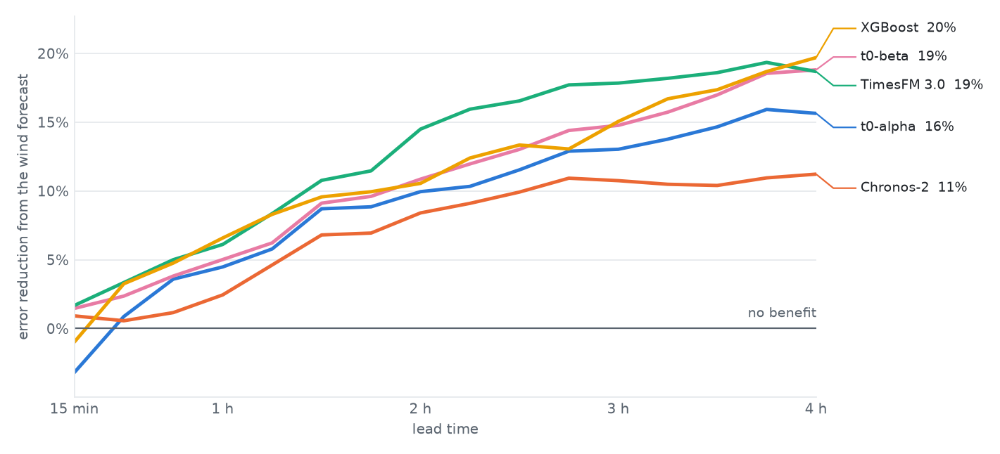
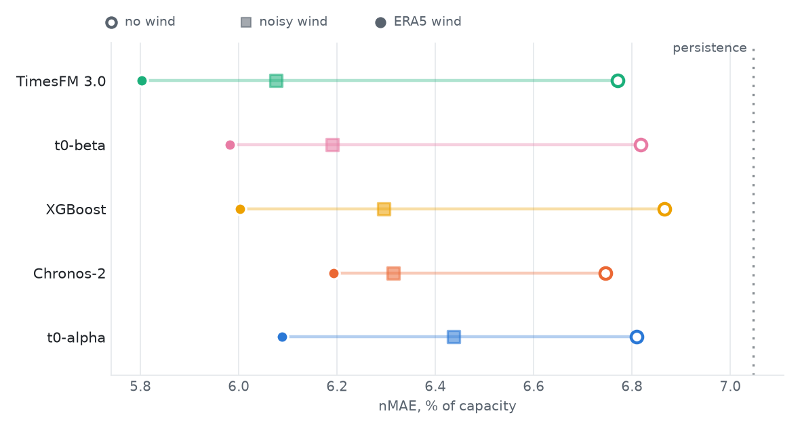
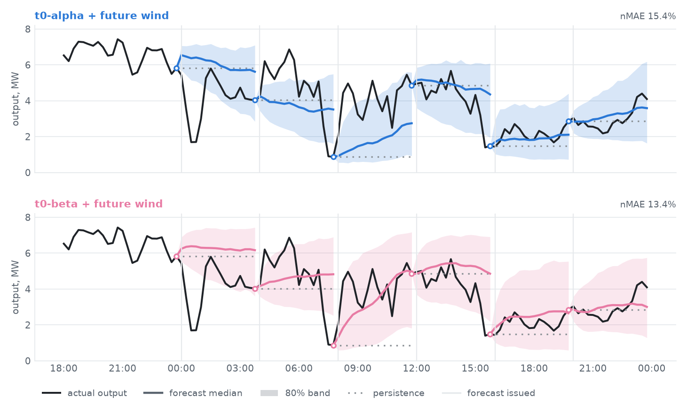

# WindBench

A benchmark of time series foundation models for short term wind power forecasting on a real wind farm.

Four foundation models (t0-alpha, t0-beta, Chronos-2 and TimesFM 3.0), used zero shot, are compared with an XGBoost model trained on the plant's own history and with two simple baselines. Every 4 hours each model forecasts the next 16 blocks of 15 minutes, the schedule used for real time wind scheduling in India.

**Interactive report:** [likith-17052004.github.io/to-alpha-wind-power-benchmarks](https://likith-17052004.github.io/to-alpha-wind-power-benchmarks/)

## Setup

<table>
  <tbody>
    <tr><td><b>Wind farm</b></td><td>ENGIE La Haute Borne, France: 4 turbines, 8.2 MW</td></tr>
    <tr><td><b>Test period</b></td><td>2015, one forecast every 4 hours (2,189 forecasts per model)</td></tr>
    <tr><td><b>Forecast</b></td><td>the next 16 blocks of 15 minutes, from 15 minutes to 4 hours ahead</td></tr>
    <tr><td><b>Setup A</b></td><td>the model sees the plant's past power output only</td></tr>
    <tr><td><b>Setup B</b></td><td>past power output plus the wind speed for the next 4 hours (ERA5, standing in for a wind forecast)</td></tr>
    <tr><td><b>Metric</b></td><td>nMAE: mean absolute error as a percentage of installed capacity (lower is better)</td></tr>
    <tr><td><b>Baselines</b></td><td>persistence (repeat the last measured value) and a power curve (wind speed converted to power)</td></tr>
  </tbody>
</table>

## Results

### Overall accuracy

<table>
  <thead>
    <tr><th>Setup</th><th>Model</th><th>nMAE %</th><th>Improvement over persistence</th><th>nMAE at 15 min</th><th>nMAE at 4 h</th><th>ms per forecast</th></tr>
  </thead>
  <tbody>
    <tr><td rowspan="6">B: past power and future wind</td><td>TimesFM 3.0</td><td><b>5.80</b></td><td><b>17.7%</b></td><td><b>2.63</b></td><td>7.37</td><td>34</td></tr>
    <tr><td>t0-beta</td><td>5.98</td><td>15.1%</td><td><b>2.63</b></td><td>7.48</td><td>104</td></tr>
    <tr><td>XGBoost (trained on the plant)</td><td>6.00</td><td>14.8%</td><td>2.87</td><td><b>7.31</b></td><td>8</td></tr>
    <tr><td>t0-alpha</td><td>6.09</td><td>13.6%</td><td>2.81</td><td>7.68</td><td>96</td></tr>
    <tr><td>Chronos-2</td><td>6.19</td><td>12.1%</td><td>2.75</td><td>8.02</td><td>41</td></tr>
    <tr><td>Power curve</td><td>7.70</td><td>minus 9.2%</td><td>7.52</td><td>7.59</td><td>0</td></tr>
    <tr><td rowspan="6">A: past power only</td><td>Chronos-2</td><td><b>6.75</b></td><td><b>4.3%</b></td><td>2.78</td><td><b>9.03</b></td><td>44</td></tr>
    <tr><td>TimesFM 3.0</td><td>6.77</td><td>3.9%</td><td><b>2.68</b></td><td>9.06</td><td>90</td></tr>
    <tr><td>t0-alpha</td><td>6.81</td><td>3.4%</td><td>2.72</td><td>9.10</td><td>25</td></tr>
    <tr><td>t0-beta</td><td>6.82</td><td>3.3%</td><td>2.67</td><td>9.21</td><td>77</td></tr>
    <tr><td>XGBoost (trained on the plant)</td><td>6.87</td><td>2.6%</td><td>2.84</td><td>9.10</td><td>7</td></tr>
    <tr><td>Persistence</td><td>7.05</td><td>0%</td><td>2.72</td><td>9.62</td><td>0</td></tr>
  </tbody>
</table>

### Accuracy by lead time

Improvement over persistence at each lead time. Coloured lines are setup B; the grey band is the range of all models in setup A.

<picture>
  <source media="(prefers-color-scheme: dark)" srcset="docs/figures/lead_time_dark.png">
  
</picture>

### Effect of the wind forecast

How much of each model's error the wind forecast removes, comparing setup B with setup A for the same model.

<picture>
  <source media="(prefers-color-scheme: dark)" srcset="docs/figures/wind_gain_dark.png">
  
</picture>

### With a realistic wind forecast

ERA5 is closer to the truth than a real forecast, so setup B was repeated with the wind degraded by timing, level and drift errors.

<picture>
  <source media="(prefers-color-scheme: dark)" srcset="docs/figures/noisy_wind_dark.png">
  
</picture>

<table>
  <thead>
    <tr><th>Model</th><th>No wind</th><th>Noisy wind</th><th>ERA5 wind</th><th>Wind benefit kept</th></tr>
  </thead>
  <tbody>
    <tr><td>TimesFM 3.0</td><td>6.77</td><td><b>6.08</b></td><td>5.80</td><td>72%</td></tr>
    <tr><td>t0-beta</td><td>6.82</td><td>6.19</td><td>5.98</td><td>75%</td></tr>
    <tr><td>XGBoost</td><td>6.87</td><td>6.30</td><td>6.00</td><td>66%</td></tr>
    <tr><td>Chronos-2</td><td>6.75</td><td>6.31</td><td>6.19</td><td>78%</td></tr>
    <tr><td>t0-alpha</td><td>6.81</td><td>6.44</td><td>6.09</td><td>52%</td></tr>
  </tbody>
</table>

### Example day

The six forecasts of 1 April 2015 for t0-alpha and t0-beta in setup B. Each forecast starts from the last measured value (open circle).

<picture>
  <source media="(prefers-color-scheme: dark)" srcset="docs/figures/example_day_dark.png">
  
</picture>

## Key findings

1. **Past power alone is not enough.** In setup A every model is only 2.6 to 4.3% better than persistence, and the differences between models are mostly not statistically significant.
2. **The wind forecast makes the difference.** It has almost no effect at 15 minutes but removes 11 to 20% of each model's error at 4 hours.
3. **Zero shot models match a model trained on the plant.** In setup B, TimesFM 3.0 is the most accurate (5.80%). t0-beta (5.98%) and XGBoost (6.00%) are level, and t0-beta is significantly better than t0-alpha (6.09%).
4. **t0-beta holds up best among the commercially usable models.** With the noisy wind forecast it reaches 6.19%, against 6.30% for XGBoost and 6.31% for Chronos-2.
5. **None of them is ready to replace an operational forecast.** At 4 hours ahead the best models still miss by about 7.3% of capacity, and sudden ramps are missed by every model.

## Method

**Schedule.** Forecasts are issued at 00, 04, 08, 12, 16 and 20 UTC. Each forecast uses the actual output up to the moment it is issued, including the 16 blocks measured since the previous forecast.

**Models.**

<table>
  <thead><tr><th>Model</th><th>Type</th><th>Size</th><th>Weights license</th></tr></thead>
  <tbody>
    <tr><td><a href="https://huggingface.co/theforecastingcompany/t0-alpha">t0-alpha</a> (The Forecasting Company)</td><td>foundation model, zero shot</td><td>102M</td><td>Apache 2.0</td></tr>
    <tr><td><a href="https://huggingface.co/theforecastingcompany/t0-beta">t0-beta</a> (The Forecasting Company)</td><td>foundation model, zero shot</td><td>256M</td><td>Apache 2.0</td></tr>
    <tr><td><a href="https://huggingface.co/amazon/chronos-2">Chronos-2</a> (Amazon)</td><td>foundation model, zero shot</td><td>120M</td><td>Apache 2.0</td></tr>
    <tr><td><a href="https://huggingface.co/google/timesfm-3.0-pytorch">TimesFM 3.0</a> (Google)</td><td>foundation model, zero shot</td><td>330M</td><td>TimesFM Non Commercial License</td></tr>
    <tr><td>XGBoost</td><td>trained on the plant's 2014 data</td><td>400 trees</td><td>Apache 2.0</td></tr>
    <tr><td>Persistence</td><td>repeats the last measured value</td><td></td><td></td></tr>
    <tr><td>Power curve</td><td>wind speed to power, fitted on 2014</td><td></td><td></td></tr>
  </tbody>
</table>

**Fair comparison.** All models get the same forecasts, the same inputs within a setup and the same scoring. Each model was tuned on October to December 2014, and the 2015 test year was never used to choose anything. The foundation models chose their history length (512 to 4,096 blocks) and whether to receive the time of day. XGBoost predicts the change from the last measured value and uses no day of year feature.

**Realistic wind forecast.** For each forecast the ERA5 wind is shifted by up to one hour, scaled by a random level error and given an error that grows over the 4 hours. Every model sees the same degraded series, and XGBoost is trained on equally degraded wind.

**Statistics.** Confidence intervals and significance tests use a bootstrap over whole days, paired across models. Excluding the 4.4% of blocks with turbine outages or curtailment changes every error by about 0.04 points and does not change the ranking.

## Running the benchmark

Requires Python 3.10 or newer and about 4 GB of disk for the model weights. On Apple Silicon the models run on the GPU; CUDA and CPU also work.

```bash
git clone https://github.com/likith-17052004/to-alpha-wind-power-benchmarks.git
cd to-alpha-wind-power-benchmarks
python3.12 -m venv .venv
source .venv/bin/activate
pip install -r requirements.txt
python -m windbench all
```

`all` runs these steps in order:

<table>
  <thead><tr><th>Command</th><th>What it does</th><th>Time on an Apple M5</th></tr></thead>
  <tbody>
    <tr><td><code>python -m windbench prepare</code></td><td>downloads the data and builds the 15 minute series</td><td>under a minute</td></tr>
    <tr><td><code>python -m windbench tune</code></td><td>tunes the foundation models on 2014</td><td>about 25 minutes</td></tr>
    <tr><td><code>python -m windbench backtest</code></td><td>runs all models over 2015</td><td>about 30 minutes</td></tr>
    <tr><td><code>python -m windbench evaluate</code></td><td>computes the metrics and significance tests</td><td>about a minute</td></tr>
    <tr><td><code>python -m windbench report</code></td><td>builds the interactive report</td><td>seconds</td></tr>
    <tr><td><code>python -m windbench figures</code></td><td>draws the charts in this README</td><td>seconds</td></tr>
  </tbody>
</table>

Command options and the code layout are described in [`windbench/README.md`](windbench/README.md).

## Limitations

1. **One wind farm and one year.** Results may differ for other sites, climates or schedules.
2. **Public data.** This dataset is widely available, so it may be part of some foundation models' training data.
3. **ERA5 is not a forecast.** It describes what actually happened, so setup B is optimistic. The noisy wind test only approximates a real forecast.
4. **No fine tuning.** The foundation models are used as released, without training on the plant.
5. **TimesFM 3.0 is for non commercial use only**, so it cannot be deployed in production.

## Data and licenses

The data is the ENGIE La Haute Borne dataset, published by ENGIE under the French Open Licence 2.0 (Etalab) and distributed with NREL's [OpenOA](https://github.com/NatLabRockies/OpenOA). It is downloaded when the benchmark runs and is not stored in this repository.

Model weights keep their own licenses: Apache 2.0 for t0-alpha, t0-beta and Chronos-2, and the TimesFM Non Commercial License for TimesFM 3.0.

The code is released under the [MIT License](LICENSE).

## Acknowledgements

Thanks to ENGIE for publishing the La Haute Borne data, to the OpenOA maintainers, and to The Forecasting Company, Amazon and Google for releasing their models.
